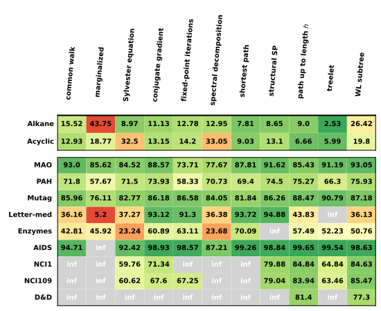
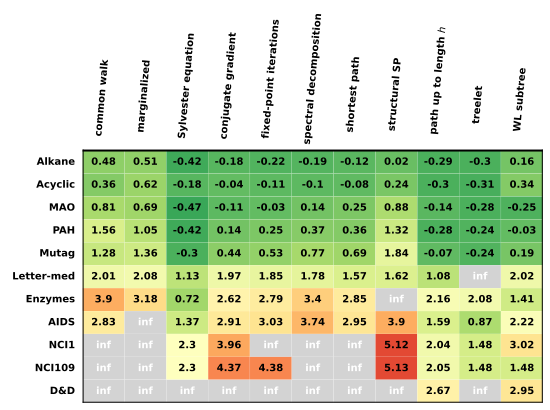

Experiments
===========

To exhibit the effectiveness and practicability of `graphkit-learn` library, we tested it on several benchmark datasets. See `(Kersting et al., 2016) <http://graphkernels.cs.tu-dortmund.de>`__ for details on these datasets.

A two-layer nested cross-validation (CV) is applied to select and evaluate models, where outer CV randomly splits the dataset into 10 folds with 9 as validation set, and inner CV then randomly splits validation set to 10 folds with 9 as training set. The whole procedure is performed 30 times, and the average performance is computed over these trails. Possible parameters of a graph kernel are also tuned during this procedure.

The machine used to execute the experiments is a cluster with 28 CPU cores of Intel(R) Xeon(R) E5-2680 v4 @ 2.40GHz, 252GB memory, and 64-bit operating system CentOS Linux release 7.3.1611. All results were run with Python 3.5.2.

The figure below exhibits accuracies achieved by graph kernels implemented in `graphkit-learn` library, in terms of regression error (the upper table) and classification rate (the lower table). Red color indicates the worse results and dark green the best ones. Gray cells with the “inf” marker indicate that the computation of the graph kernel on the dataset is omitted due to much higher consumption of computational resources than other kernels.

The figure below displays computational time consumed to compute Gram matrices of each graph
kernels (in :math:`log10` of seconds) on each dataset. Color legends have the same meaning as in the figure above.

